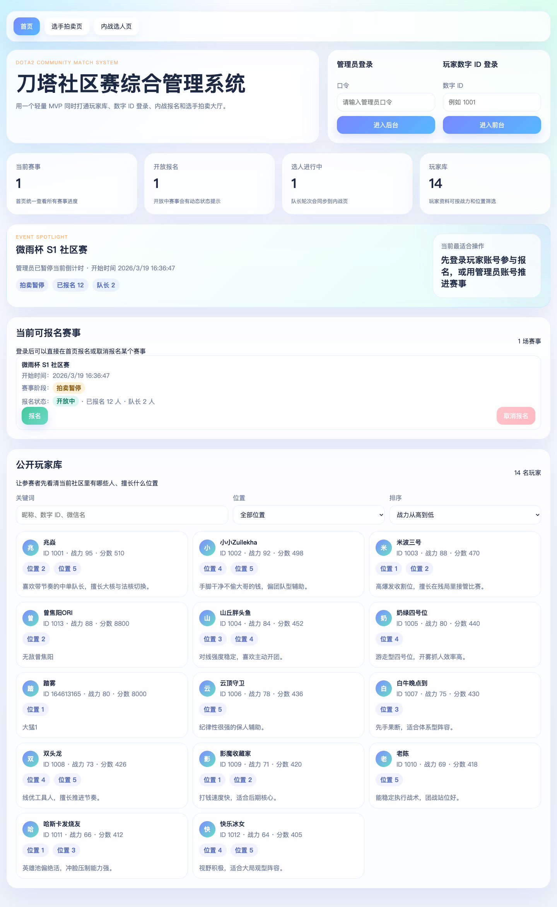
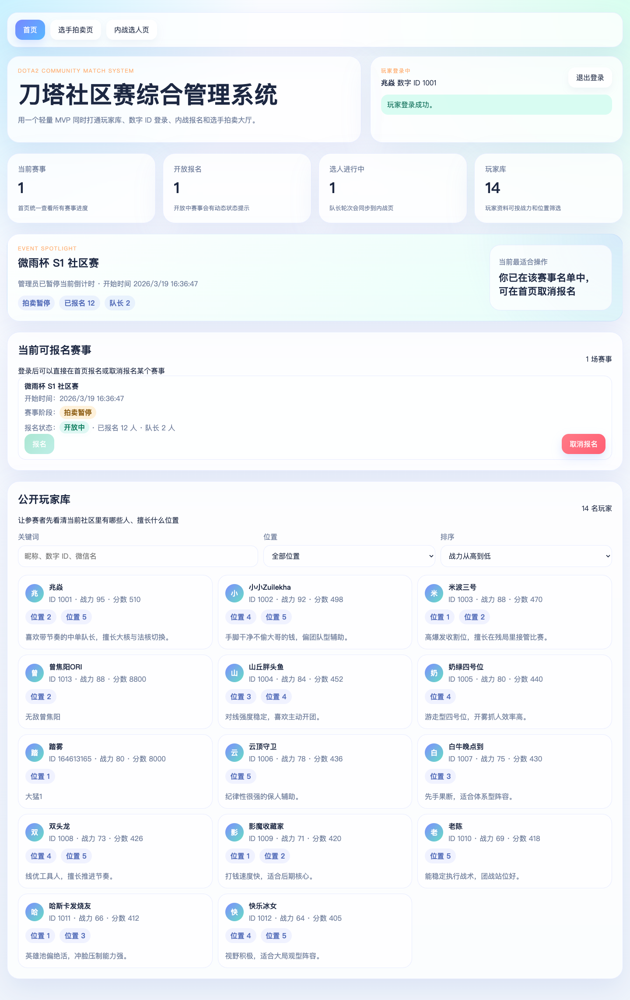
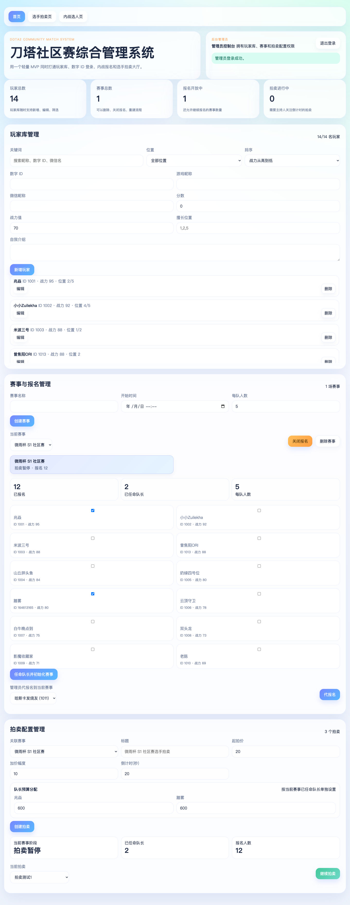
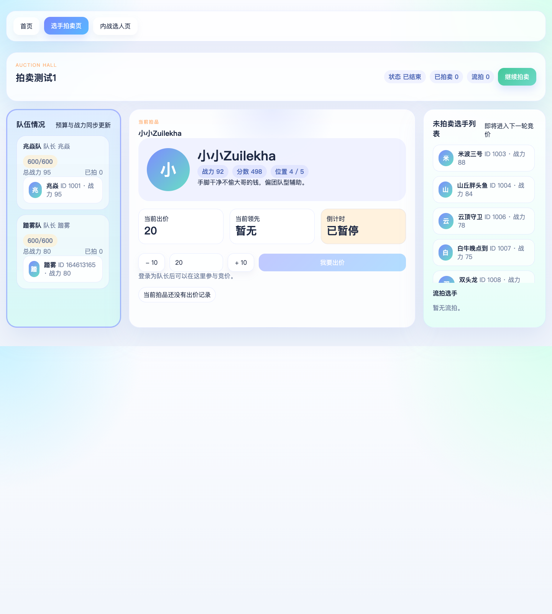
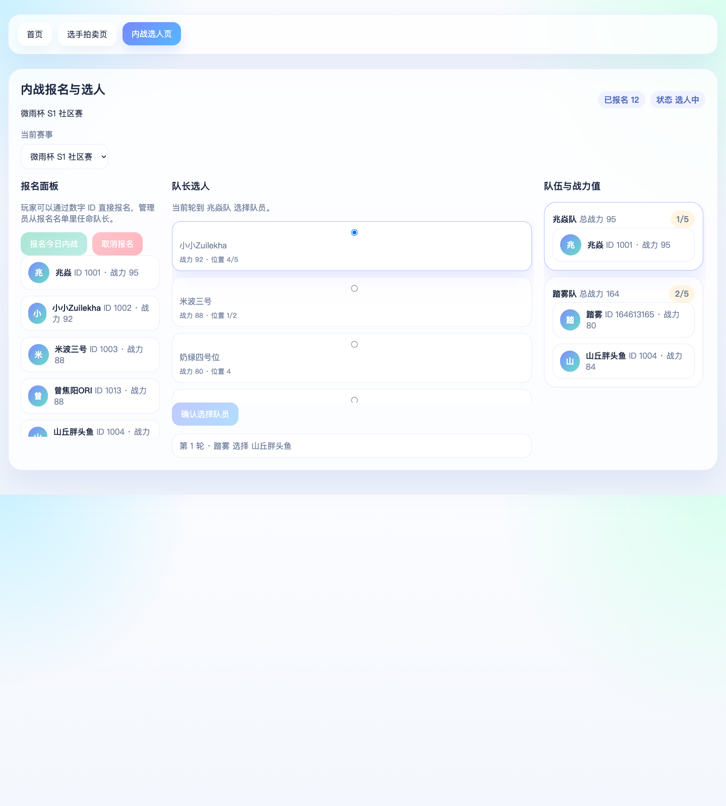

# DCMS 图文用户指南

## 1. 系统简介
DCMS 是一个面向 DOTA2 社区赛事的轻量管理系统，当前版本支持：
- 玩家库管理
- 数字 ID 登录
- 赛事创建与报名
- 队长任命与内战选人
- 选手拍卖与竞价

当前临时访问地址：
- [http://150.158.55.21](http://150.158.55.21)

说明：
- 因域名备案原因，当前系统暂时通过公网 IP 访问
- 后续域名恢复后，可再切回正式域名入口

## 2. 角色说明

### 管理员
管理员可以：
- 登录后台
- 管理玩家库
- 创建赛事
- 开启或关闭报名
- 代玩家报名
- 任命队长并初始化赛事
- 创建拍卖并设置队长预算
- 启动、暂停、继续拍卖

### 普通玩家
普通玩家可以：
- 通过数字 ID 登录
- 查看当前赛事
- 报名或取消报名
- 查看公开玩家库

### 队长
队长是由管理员从报名玩家中任命的特殊玩家，可以：
- 在内战选人页选择队员
- 在拍卖页代表自己的队伍出价

## 3. 首页未登录状态
未登录时，首页会展示：
- 管理员登录入口
- 玩家数字 ID 登录入口
- 当前赛事概览
- 公开玩家库

使用方式：
1. 管理员输入后台口令后进入后台
2. 玩家输入自己的数字 ID 后进入前台
3. 未登录访客也可以先查看公开赛事信息和玩家库

## 4. 玩家登录后的首页
玩家登录后，首页会重点展示：
- 当前可报名赛事
- 赛事当前阶段
- 报名状态
- 已报名人数
- 公开玩家库筛选

玩家可以在这里完成的操作：
1. 浏览当前赛事列表
2. 点击 `报名` 加入开放报名的赛事
3. 点击 `取消报名` 退出已报名赛事
4. 在公开玩家库中按关键词、位置、战力排序查看玩家资料

注意：
- 只有开放报名的赛事才能报名
- 已报名后才会显示 `取消报名`

## 5. 管理员登录后的首页
管理员登录后，首页会切换为后台工作区。

主要包含三块：
- 玩家库管理
- 赛事与报名管理
- 拍卖配置管理

同时会展示当前关键概览数据：
- 玩家总数
- 赛事总数
- 报名开放中的赛事数量
- 当前拍卖情况

管理员常用操作入口：
1. 在玩家库中新增、编辑、删除玩家
2. 创建赛事并调整报名状态
3. 代玩家报名
4. 任命队长并初始化赛事
5. 为拍卖配置预算并创建拍卖

## 6. 玩家库管理
在 `玩家库管理` 卡片中，管理员可以：
- 新增玩家
- 编辑玩家资料
- 删除未进入赛事流程的玩家
- 按关键词搜索
- 按位置筛选
- 按战力排序

新增或编辑玩家时建议填写：
- 数字 ID
- 游戏昵称
- 微信昵称
- 分数
- 战力值
- 擅长位置
- 自我介绍

注意：
- 数字 ID 必须唯一
- 数字 ID 创建后不可修改

## 7. 赛事与报名管理
管理员可在 `赛事与报名管理` 中完成：
- 创建赛事
- 切换当前赛事
- 开启或关闭报名
- 删除赛事
- 从报名名单中选择队长
- 代玩家报名

常见流程：
1. 先创建赛事
2. 开启报名
3. 等玩家报名
4. 从报名名单中勾选队长
5. 点击 `任命队长并初始化赛事`

注意：
- 队长必须来自已报名玩家
- 删除赛事时，会一并清理关联内战和拍卖数据

## 8. 选手拍卖页
拍卖页主要分成三部分：
- 左侧：队伍情况
- 中间：当前拍品与竞价区
- 右侧：未拍卖选手与流拍选手

### 管理员可以做什么
- 查看拍卖当前状态
- 暂停拍卖
- 继续拍卖

### 队长可以做什么
- 查看自己队伍预算
- 查看当前拍品
- 调整出价金额
- 点击 `我要出价`

### 拍卖规则
- 出价必须满足当前最低加价要求
- 出价不能超过队伍剩余预算
- 倒计时结束自动成交
- 没有有效出价时，选手会流拍

## 9. 内战选人页
内战选人页主要分为：
- 左侧：报名面板
- 中间：队长选人区
- 右侧：队伍与战力值

### 普通玩家能看到什么
- 当前赛事名称
- 已报名人数
- 当前轮次
- 剩余选手池
- 各队当前阵容和总战力

### 队长能做什么
- 在轮到自己时，从中间选手池选择队员
- 点击 `确认选择队员`

### 系统规则
- 只有当前轮到的队长可以选人
- 非当前队长不能操作
- 每次选人后，系统会自动更新队伍总战力和选人记录

## 10. 推荐使用流程

### 内战使用流程
1. 管理员提前录入玩家库
2. 创建内战赛事
3. 开启报名
4. 玩家使用数字 ID 登录并报名
5. 管理员任命队长
6. 初始化赛事
7. 队长进入内战选人页完成选人

### 拍卖使用流程
1. 管理员创建赛事
2. 玩家报名
3. 管理员任命队长
4. 在拍卖配置中为每位队长分配预算
5. 创建拍卖
6. 启动拍卖
7. 队长在拍卖页竞价
8. 如有需要，管理员可暂停或继续拍卖

## 11. 常见问题

### 为什么玩家不能报名？
请检查：
- 当前赛事是否开放报名
- 玩家是否已经报名
- 玩家是否使用正确数字 ID 登录

### 为什么某个玩家不能被设为队长？
因为队长必须从当前赛事的报名名单中产生。

### 为什么队长不能选人？
请检查：
- 当前赛事是否已经初始化
- 是否轮到该队长
- 是否已选中可选玩家

### 为什么队长不能出价？
请检查：
- 当前登录账号是否是该拍卖中的队长
- 当前拍卖是否已经开始
- 出价是否符合最低加价要求
- 队伍预算是否足够

## 12. 备注
- 本图文指南基于当前线上演示环境自动截图生成
- 页面数据会随着赛事操作而变化，因此实际显示内容可能与截图略有不同
- 当前版本为 MVP，后续如新增 Excel 导入导出、更多角色权限或数据库能力，本指南也需要同步更新
